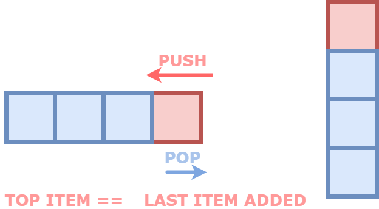

# Stack - Abstract Data Type

## What it is ?

- a stack is simply a concept; an idea that enables the arrangment of data in linear sequence.
- storage & retrieval of the dataset strictly abides by the LIFO principle.
- the principle imposes the crucial design constraint;it is only ever permissable to alter the top of the stack.
- In other words, LAST ITEM IN --> FIRST ITEM OUT

## Where is the benefit/ use cases ?

- Imposing LIFO constraint establishes controlled data access
- Support for UNDO / REDO actions - a feature common in text editors.
- JavaScript Call Stack uses stack to manage and thread through various invocation contexts - the topmost element refers to the currently active context.
- Keeping track of recursive calls can be handled by Stacks.
- Reversing a Sequence of data ,for instance, a string reversal can be implemented using stacks.
- Parsers use stack to validate syntax correctness. matching bracket pair etc..
- Browser History can be thought of as a series of stackframes.

## Visual Representation:



## General Interface

Typical interface of a Stack tends to boil down to these crucial methods:

1. **push()**
2. **pop()**
3. **peek()**
4. **isEmpty()**

## Possible implementation (using **Arrays**)

```javascript
class ArrayStack {
  constructor() {
    this.stack = [];
    this._size = 0;
  }

  get size() {
    return this._size;
  }
  isEmpty() {
    return this.size() === 0;
  }
  peek() {
    if (!this.isEmpty()) {
      return this.stack[this.size() - 1];
    }
  }
  pop() {
    this._size--;
    return this.stack.pop();
  }

  push(element) {
    this._size++;
    this.stack.push(element);
  }
}

export default ArrayStack;
```
