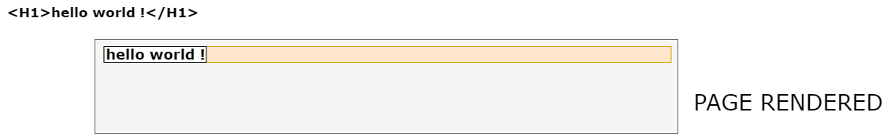
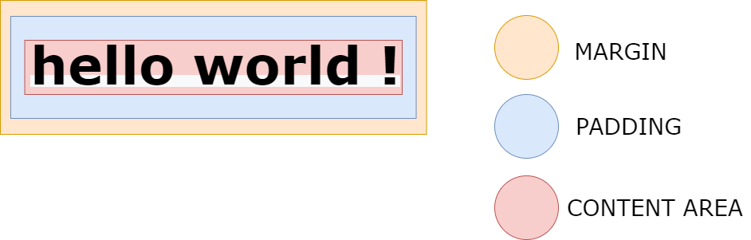

#THE BOX MODEL notes
 
## WHAT 

-box model represents a composition of the page
-it dictates how each element participating in layout flow gets rendered on screen 
-in CSS, every HTML element is visually represented as a rectangular box.
Each such box has OUTER and INNER  display types
- this is crucial as every element on page is laid out with respect to is containing block ,which provides the necessary layout context.
- OUTER type  governs how each box aligns with other elements participating in the same formatting context  
-
- additionally, DISPLAY TYPE of each element indicates how such element gets rendered on screen
- understanding  of rules how each element relates to another is critical in composing multiple "box-shaped" elements into a complete layout. 
  
## BOX MODEL CLOSE-UP

#BASIC BOX TYPES -
##OUTER TYPE  -->these constrain indivudal elements in relation to surrounding elements. This is the default behaviour  when no CSS styling is applied.
 1.BLOCK
 2.INLINE
 3.TABLE ? 

#INNER DISPLAY TYPES --> THESE control how CHILDREN of the particular element behave when rendered
1.FLEX---->flex items  (outer ---> BLOCK)
2.GRID---> grid items   (outer ---> BLOCK)
3.TABLE ----> table cells  (outer ---> BLOCK)

1.BLOCK
-participates in block-formatting context .meaning it:
  -spans 100% of the parent width 
  -pushes siblings onto new line

2.INLINE
-participates in inline-formatting context,meaning it: 
- is as wide as the content
- aligns inline
- wraps onto a new line  when there is no space
- only respects horizontal  paddings & margins
- height controlled by line-height 
- vertical align is supported

3 TABLE
- does not span 100% by default
- border-spacing
- margins are ignored !
- embbed table inside a container with negative margins  to remedy above issue 
- vertical align is supported

--------WITH CSS MODIFICATION----------
4.INLINE-BLOCK
-hybrid between block and inline
-respects vertical margin and padding values +  content height

- with BOX MODEL, we may control : 
  1. SIZE of the element
  2. WIDTH of the element
  3. HEIGHT of the element
  4. POSITION of the element 
  5. BACKGROUND of the element
  6. MARGIN between two elements
  7. PADDING of the element's box
  8. BORDER of the element 
  9. OUTLINE of the element

 

-above image depicts how a heading  element is rendered onto the screen
-it may be observed that  the element takes up the full available width, even though its content requires just a portion of it 
-The heading element belongs to a group of elements known as "BLOCK-LEVEL" elements
-every block-level element has its width set to 100%  of its parent container; it is their default behaviour

 
 
 ##MARGIN
 -Margin area controls the distance between two adjacent elements
 - margins can be 0
 - can be negative 
 MARGIN COLLAPSING
  - VERTICAL margin of two adjacent block level elements collapse by default (larger value eats the smallest)
 - Property names:
   1. Margin-top 
   2. Margin-bottom
   3. margin-left
   4. margin-right

-Shorthands
 margin {2 values}  <top,bottom> , <left right>
 margin {1 value}  applies the specified value  to every prop listed above
 
 ##PADDING
 -padding represents the distance between the content area and the border edge  - which, of course, I deliberately omitted from the Model box depiction.
 -when specifying padding values,as with margins , precisely identical rules apply here
 
 ##CONTENT AREA
 - default size of the box 
  1. width  = left_border + left-padding + content_width right_padding +right_border
  2. height = top_border_ + top-padding + content_height bottom_padding +bottom_border

##BORDERS
- cannot have negative value 
- pushy borders !
   -especially applicable when animating border lines

UNDECLARED VALUES:
-borders  ===> 0 or borwser default

-width  ===> IF the element's position is set to STATIC or RELATIVE  then:
  1.width is set to 100% of parent containing block's width. More accurately, whatever width value is left to be distributed. in other words:
   ==> parent_width (100%) - content_area_width = width_left_to distribute 
  

 
 
ABSOLUTE POSITION
 -width as wide as required to accommodate the content.
 -this trend continues until content reaches 100% width of its parent containing block
 -the parent containing block of ABSOLUTELY positioned elements is always nearest ancestor with a position other than static
 -best practice for parent positioning  is to set it to POSITION RELATIVE to avoid confusion 
 
 FLOATS
  - they have no width !!!!
  - they are essentially removed from the normal document flow 

 INLINE ELEMENTS
 -line-up horizontally
 -as wide as the content they represent
 -wrap at each line
 -line height controls the heightof inline element's height
 -above point means they lack padding & margin top and bottom 
 
 INLINE BLOCK
 - combining the best of inline and block level elements
 - they line up horizontally as much as possible
 - they support margins,paddings and borders (top and bottom)
 - BEWARE OF EXTRA WHITE SPACE !!!!!!!!!!!!!!!!!!!!!!!!!!!  
 - white space counts as a charater entity -  it is therefore rightfully recognised by the layout engine 
  
  
  ##CONTAINING BLOCK WIDTH with DEFAULT BOX MODEL:
  
  WIDTH  ==> CONTENT_WIDTH
   -is calculated from the edges of inner content block
   -specifically, it travels from the left edge to the right edge
  HEIGHT
   - FROM top to bottom , inner edges of the content area 

  BOX_SIZING = CONTENT BOX
 TOTAL WIDTH  = LEFT MARGIN + LEFT BORDER  LEFT PADDING + CONTENT_WIDTH + RIGHT PADDING + RIGHT BORDER  + RIGHT MARGIN
 TOTAL HEIGHT  = TOP MARGIN +  TOP BORDER  TOP PADDING + CONTENT_HEIGHT + BOTTOM PADDING + BOTTOM BORDER  + BOTTOM MARGIN
 
 BOX SIZING = BORDER BOX
  TOTAL WIDTH  = LEFT MARGIN + WIDTH   RIGHT MARGIN
 TOTAL HEIGHT  = TOP MARGIN + HEIGHT + BOTTOM MARGIN
  
  # ABSOLUTE v FIXED v RELATIVE v STATIC v STICKY
  
  ##ABSOLUTE
  -powerful, you can place your element exactly where you desire
  -removed from the document flow in entirety 
  -does not affect other elements
  -technique has obvious drawbacks 
  -less flexible/ unresponsive, and is not device-agnostic 
  -essentially, enables modification of TOP, LEFT , BOTTOM and RIGHT values
  -those values are derived from the nearest element /ancestor that has its position explicitly defined to something other than STATIC , which is the default 
  -if none can be found, it defaults back to HTML
 
 ##RELATIVE
 -relative to itself 
 - if no TOP LEFT BOTTOM RIGHT values are defined, the element's  positioning remains unaffected
 - Typically, this positioning is utilised to limit the scope of absolutely positioned  elements 
 - every child of  relative element can be absolutely positioned inside of it

##FIXED
- it behaves similarly to ABSOLUTE positioning
- BUT-> it is awlays fixed to the viewport UNLESS:
   1. transform perspective is set
   2. FILTER poperty has a value defined 

##STICKY
- a hybrid between relative and fixed positioning 
- specify TOP, LEFT, RIGHT  or  BOTTOM value to indicate a "switch transition" threshold
- TOP 10px --> beyond 10px , the element will act as a fixed positioned element until the boundary of its parent has been reached 
  
  
#AUTO property 
-calculated  remaining width needed to make up the 100% of the parent containing block  
- only applicable to :
  1. width
  2. height
  3. margins

-other properties must have value explicitly defined or set to 0  

-single auto  and 2 specific values ? 
auto = 100%  - (value1 + value2)
- 3 autos:
-  1.margins are set to 0 
-  width or height set to 100% 

IF ALL values are declared ANDD they are less than 100% in parent's width 
MARGIN right is forced to AUTO
BOX-sizing determines the width not AUTO  behaviour 

- total width  must add up to 100% of the containing block 

FOR REPLACED ELEMENETS
- width auto becomes INTRINSIC

PERCENTAGE HEIGHT
- calculated from the HEIGHT of the containing block's content area
- only appliedif the parent's height is not specific (not set using percentages)
- otherwise, AUTO is used fro the height of the children 
   

